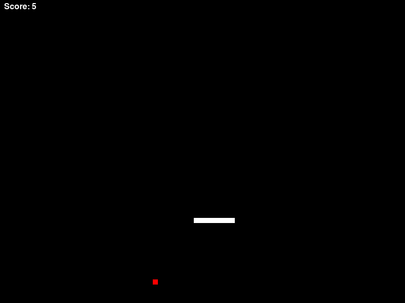

# 🐍 Snake Reloaded

Welcome to the classic **Snake Game**! Built with Python and Pygame, this game combines a bit of nostalgia with a modern twist. 🎮

## 📜 Table of Contents

- [Features](#-features)
- [How to Play](#-how-to-play)
- [Controls](#-controls)
- [Getting Started](#-getting-started)
- [Screenshots](#-screenshots)
- [Credits](#-credits)

## ✨ Features

- 🎨 **Smooth gameplay** at adjustable frame rates
- 🍏 **Randomly generated food** for endless fun
- 📊 **Score tracking** to challenge your high score
- 🕹️ **Replayable** game functionality

## 🕹️ How to Play

The objective is simple: eat the food that appears on the screen to grow your snake! The game ends when the snake collides with itself or the wall.

## 🎛️ Controls

- **Arrow Keys**: Control the direction of the snake
- **Space**: Start the game
- **R**: Restart the game after game over

## 🖼️ Screenshots



## 🚀 Getting Started

### Prerequisites

Ensure you have **Python 3.11.x** and **Pygame** installed.

Install Pygame using pip:

```bash
pip install pygame
```

### Run the Game

1. Clone the repository:
   ```bash
   git clone https://github.com/navinyp/pygame_snake.git
   ```
2. Navigate to the directory:
   ```bash
   cd pygame_snake
   ```
3. Run the game:
   ```bash
   python snake_game.py
   ```
---

## 🛠️ Build Instructions

Follow these steps to package the game as a Windows executable:

### Prerequisites

- **Python 3.11.x** installed on your system.
- **Pygame** and **PyInstaller** installed via pip:

  ```bash
  pip install pygame pyinstaller
  ```

### Steps to Build

1. **Run PyInstaller** to create the executable:

   ```bash
   pyinstaller --onefile --windowed snake.py
   ```

   - `--onefile`: Packages everything into a single executable file.
   - `--windowed`: Runs the game without a command prompt window.

   If you have a custom icon for the game, use the `--icon` option:

   ```bash
   pyinstaller --onefile --windowed --icon=icon.ico snake.py
   ```

2. **Run the Executable**: After running the command, the `.exe` file will be located in the `dist` folder.

## 🤝 Credits

Created by Navin Pemarathne. Inspired by the timeless Snake Game we all know and love! ✨